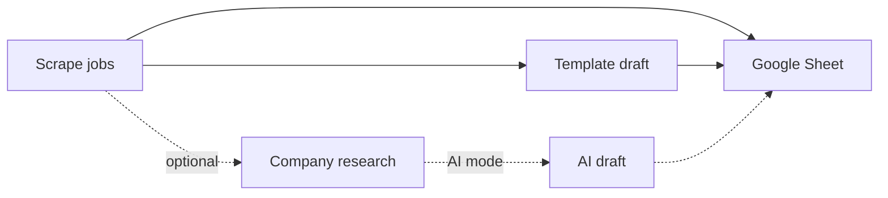

# LinkedIn Job Automation Tool

Scrape LinkedIn jobs, generate referral message drafts, and sync everything to a Google Sheet — ready for you to apply and reach out manually.

**Default workflow:** scrape → template message → sheet. No company research, no LLM calls, no extra LinkedIn browsing.

## Features

- **Job scraping** — Playwright over a persistent Chrome profile (CDP attach)
- **Template messages** — Fixed referral note with job URL, company, role, and category-matched CV link (default)
- **AI messages** — Optional OpenRouter LLM drafts when company research is enabled
- **Google Sheets** — Single `Jobs` tab with job links, locations, and messages (deduped by job ID)
- **MongoDB** — Jobs, research, and messages stored for querying and export
- **Scheduled daemon** — Cron-style scrape / enrich / draft stages via `scripts/pipeline_daemon.py`

## Quick start

```bash
# 1. Install dependencies
uv sync
source .venv/bin/activate

# 2. Configure environment
cp .env.example .env
# Edit .env — see Setup below

# 3. Log into LinkedIn once (persistent browser profile)
python scripts/linkedin_login_once.py

# 4. Run pipeline
python main.py --keywords "software engineer" --location "Singapore" --max-results 5
```

Open your Google Sheet — each row has a job URL (column E) and a referral message (column H).

## Setup

### 1. Dependencies

```bash
uv sync
source .venv/bin/activate   # macOS/Linux
```

Or with `requirements.txt`:

```bash
uv venv && source .venv/bin/activate
uv pip install -r requirements.txt
```

### 2. Environment variables

Copy `.env.example` to `.env` and configure:

| Variable | Required | Description |
|---|---|---|
| `MONGODB_URI` | Yes | MongoDB connection string |
| `LINKEDIN_BROWSER_PROFILE_DIR` | No | Persistent Chrome profile dir (default: `.linkedin_browser_profile/`) |
| `LINKEDIN_CDP_PORT` | No | CDP port for Chrome attach (default: `9222`) |
| `GOOGLE_SHEETS_SPREADSHEET_ID` | For Sheets | Spreadsheet ID from the sheet URL |
| `GOOGLE_APPLICATION_CREDENTIALS` | For Sheets | Path to Google service account JSON |
| `OPENROUTER_API_KEY` | AI mode only | OpenRouter API key |
| `MODEL_NAME` | AI mode only | e.g. `anthropic/claude-sonnet-4` |
| `USE_TEMPLATE_MODE` | No | Overrides `pipeline_config.yaml` (`true` / `false`) |

### 3. LinkedIn login (one-time)

Automation uses a **dedicated Chrome profile**, not your daily browser:

```bash
python scripts/linkedin_login_once.py
```

Log in manually in the window that opens. The session persists on disk. Re-run when LinkedIn expires the session.

### 4. MongoDB

- **Local:** `mongodb://localhost:27017/linkedin_automate`
- **Atlas:** create a free cluster at [mongodb.com/cloud/atlas](https://www.mongodb.com/cloud/atlas)

### 5. Google Sheets (optional)

1. Create a Google Cloud service account with Sheets API access
2. Share your spreadsheet with the service account email (Editor)
3. Set in `.env`:
   ```
   GOOGLE_APPLICATION_CREDENTIALS=./your-service-account.json
   GOOGLE_SHEETS_SPREADSHEET_ID=your_spreadsheet_id
   ```
4. Enable in `scripts/pipeline_config.yaml`:
   ```yaml
   google_sheets:
     enabled: true
   ```

**Sheet layout** (single `Jobs` worksheet):

| A | B | C | D | E | F | G | H |
|---|---|---|---|---|---|---|---|
| Job ID | Job Title | Company | Location | Job URL | Company URL | Search Query | Message |

New jobs are appended (existing job IDs skipped). Messages are written to column H after draft generation.

### 6. AI mode (optional)

Only needed if you disable template mode and use `--with-research`:

- Get an API key at [openrouter.ai/keys](https://openrouter.ai/keys)
- Set `OPENROUTER_API_KEY` and `MODEL_NAME` in `.env`
- Set `generator.use_template_mode: false` in `scripts/pipeline_config.yaml`

## Usage

### Run full pipeline

Default: scrape → template drafts → Google Sheet (no research).

```bash
# Basic
python main.py --keywords "software engineer" --location "Singapore"

# Limit results
python main.py --keywords "software engineer" --location "Singapore" --max-results 10

# Optional: company research + AI drafts (slower, more LinkedIn traffic)
python main.py --keywords "software engineer" --location "Singapore" --with-research

# Scrape only (no messages)
python main.py --keywords "software engineer" --skip-messages
```

### Message template

Template file: `golden_drafts/linkedin_note_template.md`

```
Hey [Name],

I just applied to [CompanyName] for [JobRole] role
job url: [JobUrl]

could you please refer me?
CV: [CvUrl] (6+ YOE)
Github: https://github.com/RMartires
```

- `[Name]` — fill in manually when messaging someone
- `[CvUrl]` — Singapore jobs use `https://tinyurl.com/yawat3hx`; all others use the default CV link
- Edit the template file to change the message; no code changes needed

### List jobs

```bash
python main.py --list
python main.py --list --status draft_generated --limit 50
```

### Export data

```bash
python main.py --export csv --status draft_generated --output jobs.csv
python main.py --export json --output jobs.json
python main.py --export csv --company "Google" --date-from 2026-01-01
```

### Scheduled daemon

Run scrape, enrich, and draft stages on a schedule:

```bash
python scripts/pipeline_daemon.py
```

Configure schedules and search targets in `scripts/pipeline_config.yaml`.

Individual stages (thin wrappers around the orchestrator):

```bash
python scripts/scrape_jobs.py --keywords "software engineer" --location "Singapore" --max-jobs 10
python scripts/generate_drafts.py --batch-size 10
python scripts/enrich_companies.py --batch-size 10   # only if using AI + research
```

## Command-line options

| Flag | Description |
|---|---|
| `--keywords` | Job search keywords (required for pipeline) |
| `--location` | Location filter |
| `--experience-level` | Entry, Mid, or Senior |
| `--job-type` | e.g. Full-time, Contract |
| `--max-results` | Max jobs to scrape (default: 50) |
| `--with-research` | Run company research (off by default) |
| `--skip-messages` | Skip message generation |
| `--export` | Export format: `json` or `csv` |
| `--output` | Export filename |
| `--status` | Filter by job/message status |
| `--list` | List jobs from database |

## Pipeline stages



| Stage | Default | What it does |
|---|---|---|
| Scrape | On | LinkedIn job search → MongoDB + Sheet |
| Research | Off | Company LinkedIn/website summaries (for AI drafts) |
| Draft | On | Template or AI referral message → MongoDB + Sheet |

## Troubleshooting

### LinkedIn not logged in

```bash
python scripts/linkedin_login_once.py
```

Complete login / 2FA in the Chrome window. Re-run when the session expires.

### Chrome profile lock / "Something went wrong" popup

Close all Chrome windows using the automation profile, then retry. The session manager clears stale lock files automatically.

### Google Sheets sync skipped

Check that all three are set:

- `GOOGLE_SHEETS_SPREADSHEET_ID` in `.env`
- `GOOGLE_APPLICATION_CREDENTIALS` pointing to a valid JSON key
- `google_sheets.enabled: true` in `pipeline_config.yaml`

The spreadsheet must be shared with the service account email.

### "LinkedIn Member" on company People pages

LinkedIn limits people browsing on free accounts (commercial use limit). Template mode avoids this by skipping company People-page visits. People scraping is not enabled by default.

## Project structure

```
linkdin_tools/
├── main.py                          # CLI entry point
├── golden_drafts/
│   └── linkedin_note_template.md    # Referral message template
├── scripts/
│   ├── pipeline_config.yaml         # Daemon + template mode + Sheets config
│   ├── pipeline_daemon.py           # Scheduled pipeline
│   ├── scrape_jobs.py
│   ├── generate_drafts.py
│   ├── enrich_companies.py
│   └── linkedin_login_once.py
└── src/
    ├── orchestrator.py              # Pipeline orchestration + Sheets sync
    ├── job_scraper_playwright.py    # LinkedIn job scraping
    ├── company_researcher_playwright.py  # Optional company research
    ├── template_draft_generator.py  # Template messages (default)
    ├── draft_generator.py           # AI messages (OpenRouter)
    ├── google_sheets_client.py      # Google Sheets integration
    ├── session_manager.py           # Chrome CDP session management
    ├── database.py                  # MongoDB operations
    ├── models.py                    # Pydantic models
    └── utils/
        ├── config.py                # Pipeline config helpers
        ├── export.py                # CSV/JSON export
        └── linkedin.py              # Shared LinkedIn helpers
```

## License

MIT
